# 批量缠论分析报告（chan.py 引擎 · 含买卖点+背驰判断）
> 数据区间：2024-01-01 ~ 2026-10-08

## 京东方A（000725）
- 最新收盘价：5.71999979019165
- 有效K线数量：666
- 笔总数：40 | 中枢总数：5
- 最新一笔走势：上涨 | 2026-09-11~2026-09-23 | 5.21 → 6.31
- 缠论背驰判断：**无背驰**
- 三类买卖点识别：**买1类@2024-09-18(3.63)、买2,3b类@2024-10-16(4.13)、买2s类@2024-11-27(4.30)、买2s类@2025-01-06(4.18)**
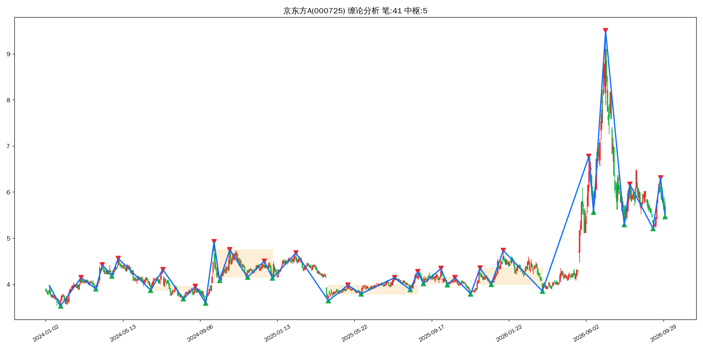

## 格力电器（000651）
- 最新收盘价：38.279998779296875
- 有效K线数量：666
- 笔总数：36 | 中枢总数：5
- 最新一笔走势：下跌 | 2026-08-25~2026-09-22 | 41.98 → 37.81
- 缠论背驰判断：**无背驰**
- 三类买卖点识别：**买1类@2024-07-05(37.70)、买2类@2024-08-13(40.23)、买2s类@2024-09-12(38.66)、卖1类@2025-07-23(48.15)、卖2类@2025-08-12(47.88)、卖3b类@2025-11-12(41.15)、买1类@2026-03-04(36.89)、买2类@2026-04-22(36.94)**
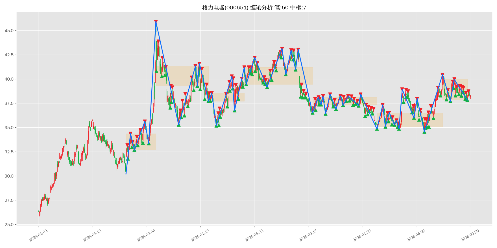

## 长安汽车（000625）
- 最新收盘价：7.110000133514404
- 有效K线数量：666
- 笔总数：34 | 中枢总数：3
- 最新一笔走势：上涨 | 2026-08-25~2026-09-14 | 7.02 → 7.35
- 缠论背驰判断：**上涨趋势背驰（警惕阶段顶部）**
- 三类买卖点识别：**买1类@2024-08-29(11.75)、买2类@2024-09-18(11.64)**
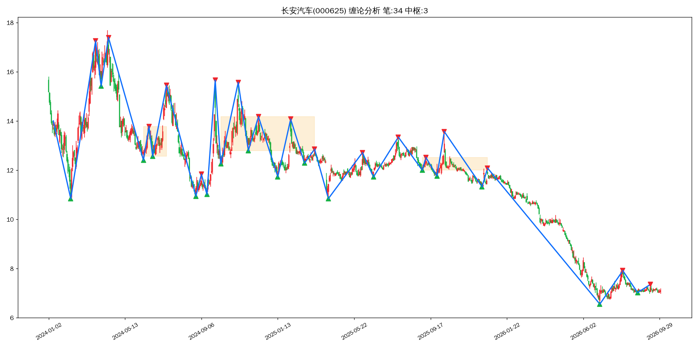

## 海南橡胶（601118）
- 最新收盘价：6.369999885559082
- 有效K线数量：666
- 笔总数：33 | 中枢总数：4
- 最新一笔走势：下跌 | 2026-09-09~2026-09-29 | 8.15 → 5.77
- 缠论背驰判断：**无背驰**
- 三类买卖点识别：**买1p类@2026-07-20(4.68)、买2类@2026-08-14(5.28)**
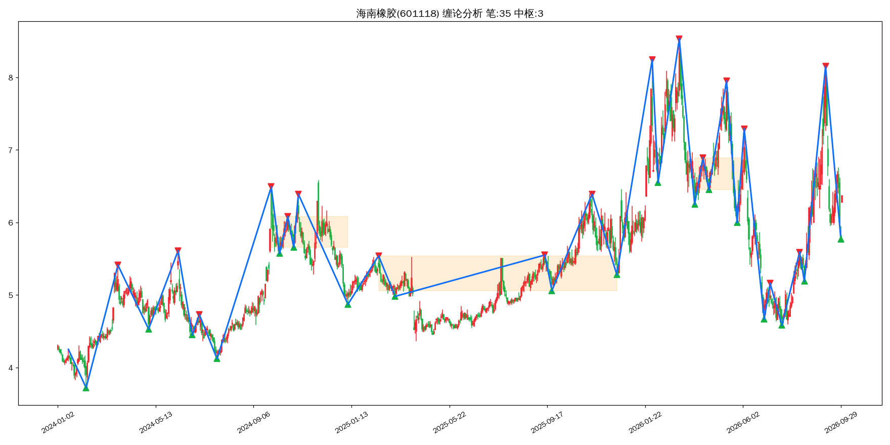

## 科大讯飞（002230）
- 最新收盘价：37.220001220703125
- 有效K线数量：666
- 笔总数：39 | 中枢总数：4
- 最新一笔走势：下跌 | 2026-09-01~2026-09-29 | 40.81 → 37.03
- 缠论背驰判断：**无背驰**
- 三类买卖点识别：**买1类@2024-08-28(33.32)、买2类@2024-10-16(43.00)、买2s类@2025-01-08(45.09)、卖1类@2025-02-24(57.45)、卖2类@2025-05-08(48.26)、卖2s类@2025-06-09(48.82)、卖2s类@2025-07-01(47.83)、买1类@2026-09-29(37.20)**
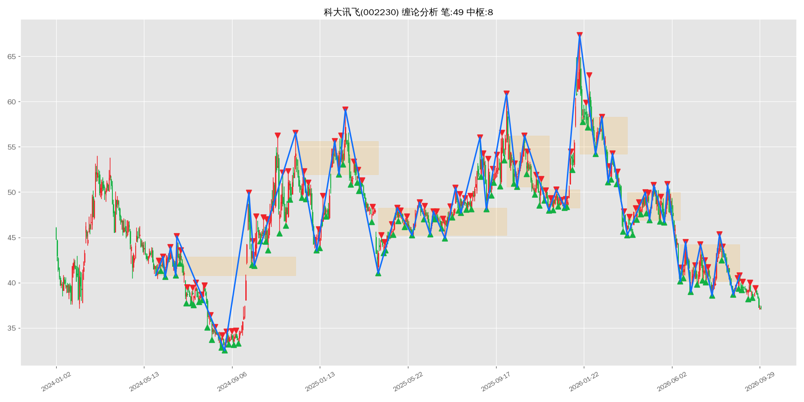

## 中国宝安（000009）
- 最新收盘价：6.929999828338623
- 有效K线数量：666
- 笔总数：28 | 中枢总数：2
- 最新一笔走势：上涨 | 2026-09-11~2026-09-22 | 6.78 → 7.13
- 缠论背驰判断：**上涨趋势背驰（警惕阶段顶部）**
- 三类买卖点识别：**买1类@2025-04-09(7.61)、买2类@2025-06-03(7.93)**
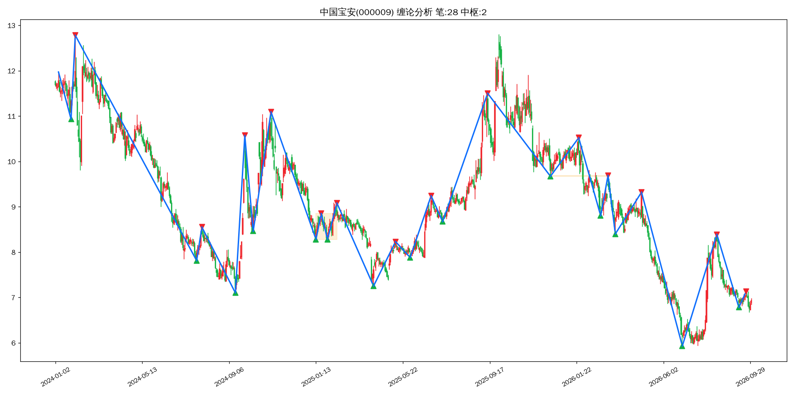

## 海格通信（002465）
- 最新收盘价：9.890000343322754
- 有效K线数量：666
- 笔总数：34 | 中枢总数：2
- 最新一笔走势：上涨 | 2026-08-21~2026-09-24 | 9.69 → 10.56
- 缠论背驰判断：**上涨趋势背驰（警惕阶段顶部）**
- 三类买卖点识别：**卖1类@2025-08-29(14.62)、卖2类@2025-09-12(13.90)**
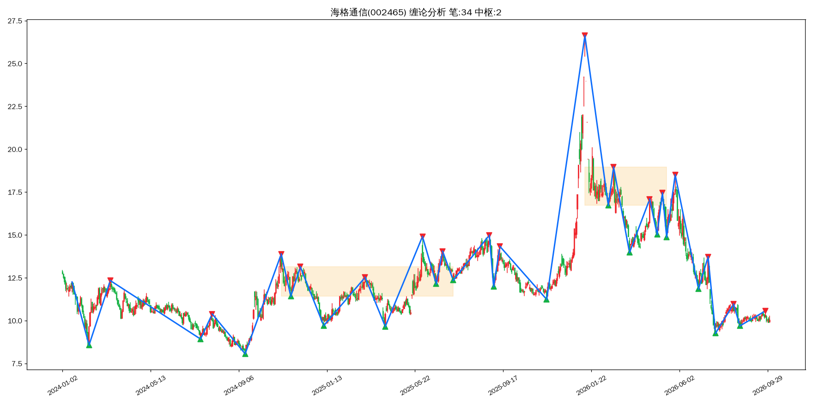

## 郑州银行（002936）
- 最新收盘价：1.7400000095367432
- 有效K线数量：666
- 笔总数：25 | 中枢总数：2
- 最新一笔走势：上涨 | 2026-08-24~2026-09-10 | 1.74 → 1.82
- 缠论背驰判断：**上涨趋势背驰（警惕阶段顶部）**
- 三类买卖点识别：**卖1类@2024-12-10(2.26)、卖2类@2025-02-18(2.01)、卖2s类@2025-07-11(2.22)、卖2s类@2025-09-18(2.07)、卖2s类@2025-11-14(2.07)、卖2s,3b类@2026-01-13(1.96)、卖2s类@2026-03-17(1.95)、买1类@2026-07-01(1.68)、买2类@2026-08-24(1.77)**
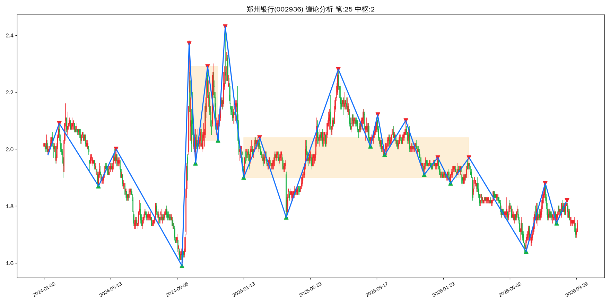

## 中国平安（601318）
- 最新收盘价：53.290000915527344
- 有效K线数量：666
- 笔总数：44 | 中枢总数：3
- 最新一笔走势：下跌 | 2026-09-04~2026-09-28 | 58.99 → 52.19
- 缠论背驰判断：**无背驰**
- 三类买卖点识别：**买1类@2025-01-13(48.59)、买2类@2025-03-04(50.08)、买3a类@2025-06-19(53.20)、卖1p类@2025-07-30(60.71)、卖2类@2025-08-29(59.88)**
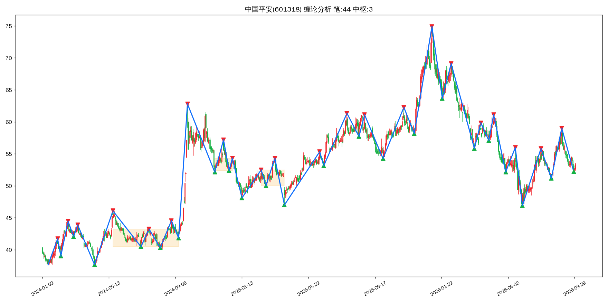

## 美的集团（000333）
- 最新收盘价：80.0999984741211
- 有效K线数量：666
- 笔总数：32 | 中枢总数：5
- 最新一笔走势：下跌 | 2026-09-15~2026-09-30 | 88.10 → 79.31
- 缠论背驰判断：**无背驰**
- 三类买卖点识别：**买1类@2025-04-07(67.18)、买2类@2025-06-16(71.26)、买2s类@2025-07-31(70.19)、买2s类@2025-10-13(71.81)、卖1类@2025-12-04(81.89)、卖2类@2026-02-05(80.45)**
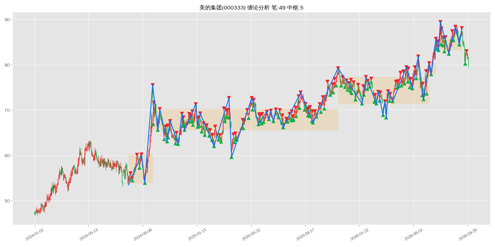

## 比亚迪（002594）
- 最新收盘价：83.30999755859375
- 有效K线数量：666
- 笔总数：50 | 中枢总数：8
- 最新一笔走势：上涨 | 2026-09-11~2026-09-22 | 82.66 → 87.20
- 缠论背驰判断：**上涨趋势背驰（警惕阶段顶部）**
- 三类买卖点识别：**卖1类@2025-05-23(135.00)、卖2类@2025-07-24(114.24)、卖2s类@2025-08-29(114.06)、卖3a类@2025-11-14(98.37)、买1p类@2025-11-21(92.70)、买2类@2025-12-18(93.53)**
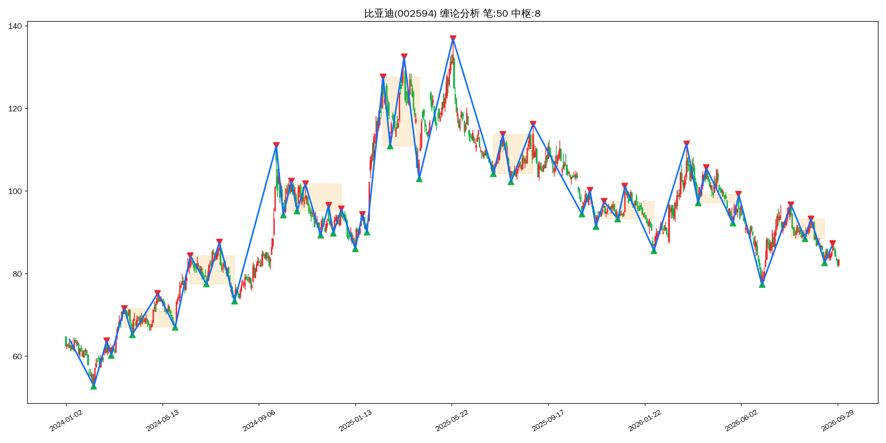

## 上证指数（000001）
- 最新收盘价：3842.195068359375
- 有效K线数量：666
- 笔总数：32 | 中枢总数：2
- 最新一笔走势：上涨 | 2026-09-16~2026-09-22 | 3842.72 → 3967.68
- 缠论背驰判断：**无背驰**
- 三类买卖点识别：**卖1p类@2025-11-14(3990.49)、卖2类@2025-12-08(3924.08)**
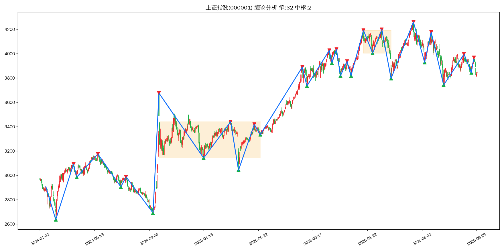

## 深证指数（399001）
- 最新收盘价：12887.6201171875
- 有效K线数量：666
- 笔总数：28 | 中枢总数：2
- 最新一笔走势：上涨 | 2026-09-16~2026-09-22 | 13185.83 → 13914.21
- 缠论背驰判断：**上涨趋势背驰（警惕阶段顶部）**
- 三类买卖点识别：**卖1类@2025-10-09(13725.56)、卖2类@2025-10-30(13532.13)、卖1p类@2026-06-22(16372.50)、卖2类@2026-08-18(14622.50)、卖2s类@2026-09-22(13723.74)**
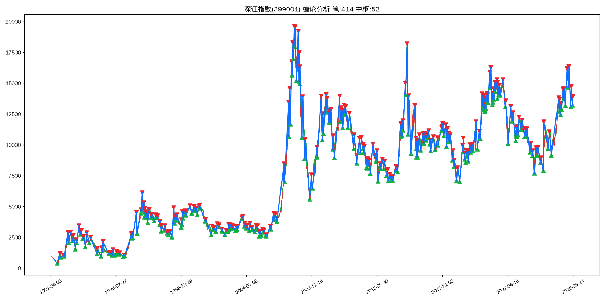

## 创业板指（399006）
- 最新收盘价：3135.277
- 有效K线数量：3968
- 笔总数：222 | 中枢总数：27
- 最新一笔走势：上涨 | 2026-09-16~2026-09-22 | 3227.18 → 3472.47
- 缠论背驰判断：**上涨趋势背驰（警惕阶段顶部）**
- 三类买卖点识别：**卖1p类@2010-12-20(1212.34)、卖2类@2011-01-06(1134.79)、卖2s类@2011-02-23(1114.05)、卖2s类@2011-03-11(1101.76)、买1类@2011-06-21(795.61)、买2类@2011-07-26(892.54)、买1类@2014-05-16(1226.47)、买2类@2014-07-24(1271.88)、买3b类@2014-10-27(1492.01)、买1类@2015-09-02(1855.03)、买2类@2015-11-03(2429.27)、卖1p类@2019-04-08(1739.65)、卖2类@2019-05-16(1533.67)、卖1类@2021-07-22(3544.44)、卖2类@2021-08-05(3532.50)、卖2s类@2021-11-30(3495.59)、卖2s类@2022-01-18(3144.33)、卖3a类@2022-03-01(2885.79)、卖1类@2023-01-30(2613.89)、卖2类@2023-04-11(2439.40)、卖2s类@2023-05-16(2294.19)、买1类@2023-06-08(2123.96)、买2类@2023-07-24(2146.93)、买1类@2024-02-05(1562.61)、买2类@2024-04-22(1750.46)、买2s类@2024-07-09(1652.12)、买2s类@2024-08-29(1541.40)、卖1p类@2026-01-13(3321.89)、卖2类@2026-02-25(3354.82)**
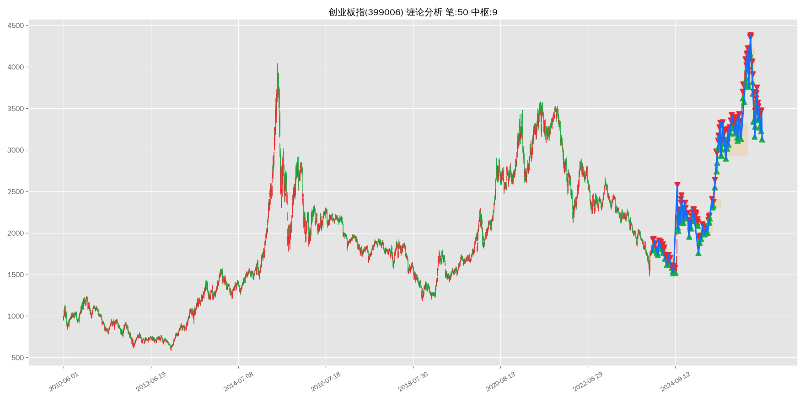

## 沪深300（000300）
- 最新收盘价：4357.616
- 有效K线数量：6003
- 笔总数：330 | 中枢总数：38
- 最新一笔走势：上涨 | 2026-09-16~2026-09-22 | 4417.60 → 4583.38
- 缠论背驰判断：**上涨趋势背驰（警惕阶段顶部）**
- 三类买卖点识别：**买1p类@2003-11-18(1081.00)、买2类@2003-12-31(1194.74)、买3b类@2004-03-09(1314.17)、卖1类@2004-04-06(1410.43)、卖2,3b类@2004-06-01(1224.11)、买1p类@2005-06-06(839.00)、买2类@2005-09-28(903.72)、买2s类@2005-11-16(863.12)、买1p类@2008-11-04(1627.76)、买2类@2008-12-01(1864.20)、买2s类@2008-12-31(1817.72)、买3a类@2009-03-03(2142.15)、卖1类@2016-08-16(3378.24)、卖2类@2016-09-07(3340.82)、买1类@2019-01-04(3035.87)、买2,3b类@2019-05-27(3637.20)、买2s类@2019-07-22(3781.68)、买2s类@2019-08-06(3636.33)、买2s类@2019-10-09(3843.24)、买2s类@2019-11-29(3828.67)、卖1类@2020-01-14(4189.89)、卖2类@2020-02-21(4149.49)、卖2s类@2020-03-05(4206.73)、卖1p类@2021-02-18(5768.38)、卖2类@2021-04-06(5140.34)、卖2s类@2021-04-26(5077.24)、卖2s类@2021-05-27(5338.23)、卖2s类@2021-06-28(5251.76)、卖2s类@2021-07-22(5151.75)、买1类@2021-07-28(4760.48)、买2类@2021-08-20(4769.27)、买2s类@2021-09-22(4821.77)、买2s类@2021-11-10(4821.19)、买1类@2022-10-31(3508.70)、买2类@2022-11-28(3733.24)、买2s类@2022-12-23(3828.22)、卖1类@2023-01-30(4201.35)、卖2类@2023-04-18(4162.03)、卖2s类@2023-05-09(4027.88)、卖2s类@2023-06-16(3963.35)、卖3a类@2023-11-06(3632.61)、买1类@2024-02-02(3179.63)、买2,3b类@2024-04-12(3475.84)、卖1类@2026-01-13(4761.03)、卖2类@2026-02-25(4735.89)、卖2s类@2026-03-17(4637.44)**
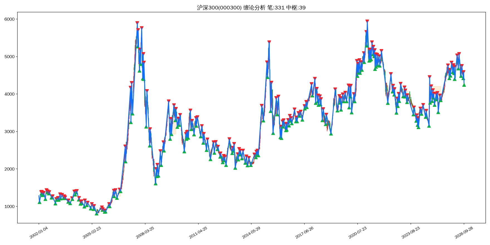

## 上证50（000016）
- 最新收盘价：2823.282
- 有效K线数量：5525
- 笔总数：298 | 中枢总数：30
- 最新一笔走势：下跌 | 2026-07-10~2026-09-28 | 3026.43 → 2794.37
- 缠论背驰判断：**无背驰**
- 三类买卖点识别：**买1p类@2005-06-06(717.21)、买2类@2005-08-31(816.75)、买2s类@2005-09-28(783.00)、卖1p类@2014-09-09(1645.11)、卖2类@2014-10-09(1634.04)、买1p类@2016-02-29(1944.61)、买2类@2016-03-29(2106.86)、买2s类@2016-05-18(2078.76)、买2s类@2016-06-15(2106.63)、买2s类@2016-08-04(2143.84)、买2s类@2016-09-27(2176.45)、卖1类@2016-11-29(2441.58)、卖2类@2017-01-26(2364.02)、卖2s类@2017-02-21(2396.88)、卖2s类@2017-04-06(2390.39)、卖2s类@2017-04-26(2344.51)、买1类@2018-07-03(2388.98)、买2类@2018-08-16(2405.16)、买2s类@2018-09-12(2381.39)、买3a类@2019-03-11(2708.60)、卖1类@2019-04-17(3017.42)、卖2类@2019-07-01(3002.94)、卖2s类@2019-07-30(2944.03)、卖1p类@2021-02-18(4014.32)、卖2类@2021-04-06(3594.71)、卖2s类@2021-04-26(3467.66)、卖2s类@2021-05-27(3664.94)、卖2s类@2021-06-25(3535.02)、卖3a类@2021-08-11(3262.57)、买1p类@2021-08-20(3072.76)、买2类@2021-09-22(3122.34)、买2s类@2021-11-10(3170.41)、买1类@2022-10-31(2295.92)、买2类@2023-03-20(2616.75)、买2s类@2023-04-25(2619.23)、买2s类@2023-05-31(2493.35)、卖1类@2024-05-20(2532.82)、卖2类@2024-07-19(2456.79)**
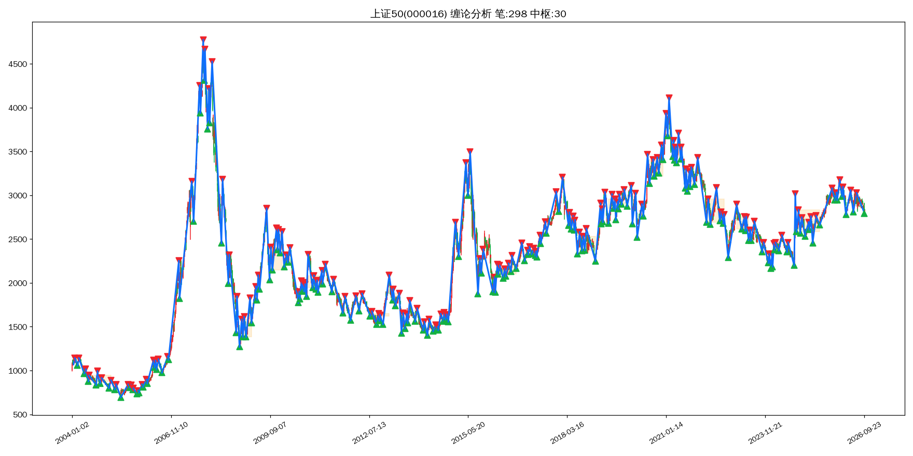
